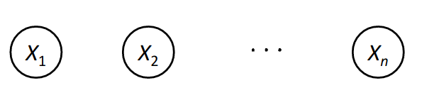
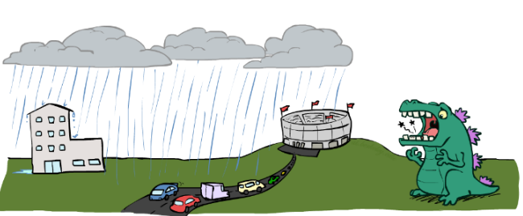

# Bayesian Network: Inference

## Table of Content
- [BN Examples](#bn-examples)

## BN Examples
These are some examples of how uncertain environment variables can be modeled as Bayesian Networks. Try to justify relations between those variable to get a better grasp of how BN works.
- ### Coin Flips
    Problem of tossing n independent coins is an example of modeling a probabilistic environment. No interaction between coins results absolute independency.

    <figure>
    
    <figcaption>BN for independent coin flip of n coins</figcaption>
    </figure>

- ### Traffic
    - Variables:
        - R: It rains
        - T: There is a traffic on the road.
    
    - Two models can be considered for such a problem:
        - independent  
            
        - independent 
            

- ### Second Traffic
    
    
    - Variables:
      - T: Traffic.
      - R: It rains.
      - L: Low air pressure.
      - D: Stadium roof drips.
      - B: There is a ballgame.
      - C: There is a cavity in *Russell* 's teeth.

    - Model: 
        Low pressure might cause rain (R is dependent to L) and rain might cause traffic. A ballgame being hold also might cause traffic and rain causes drips from stadium roof. Russell's tooth cavity (name of the green monster) is independent from other variables, so BN of this environment is presented in the following figure:

        
        
        In this environment rain can cause ballgame be canceled, so B is slightly dependent on R which is shown by blue arrow from R to B, but to keep our model as simple as possible, we tend to not include this relation in our BN. This results in ignoring some information from problem's environment, So we need to keep a balance between model simplicity and information loss.

- ### Alarm Network
    Assume there is an alarm system in your house which is supposed to go off when a burglary happens. It also might go off if an earthquake happens. If alarm goes off Marry and John might call you. What is the BN representation of this environment.
    - Variables:
      - B: Burglary
      - A: Alarm goes off
      - M: Marry calls
      - J: John calls
      - E: Earthquake
    - Representation: <!-- BN !-->
