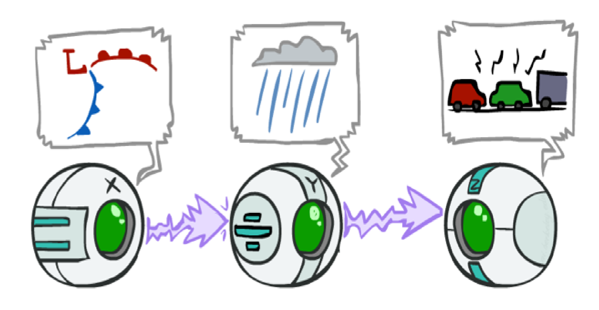
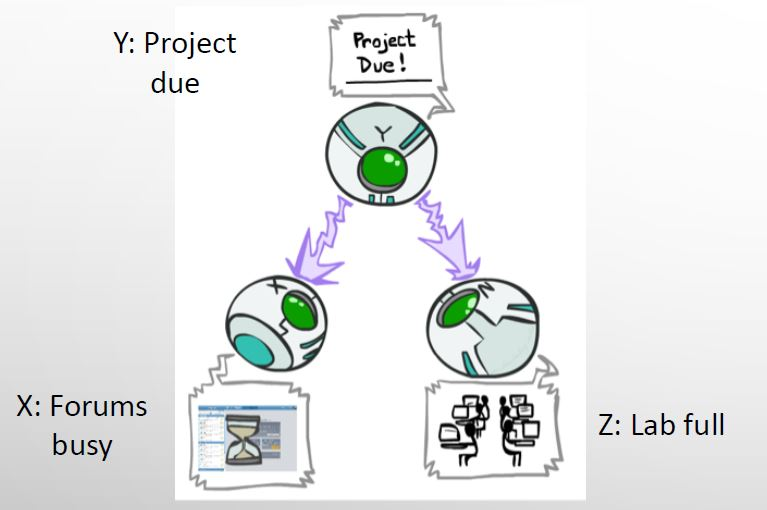
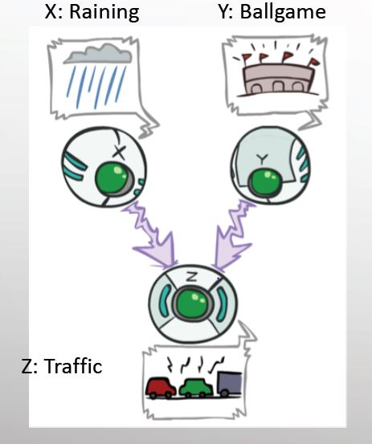
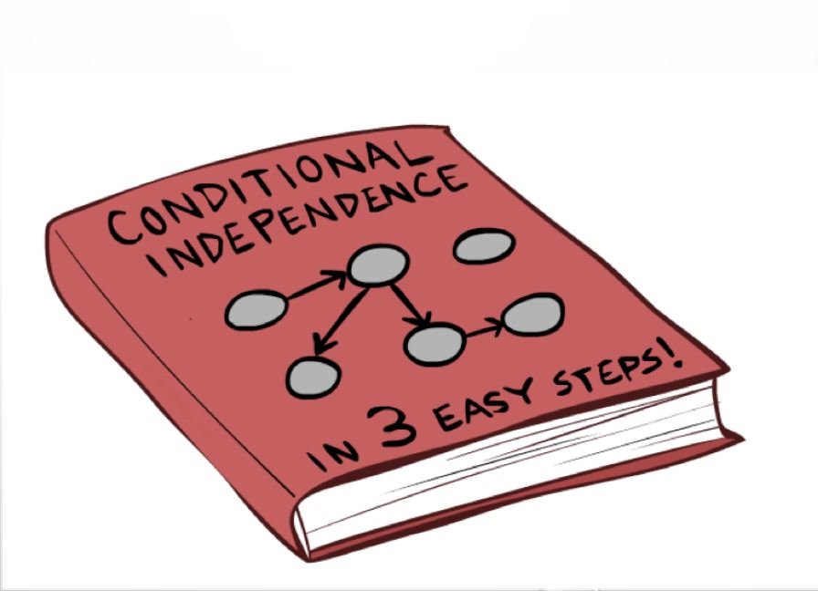
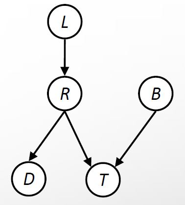
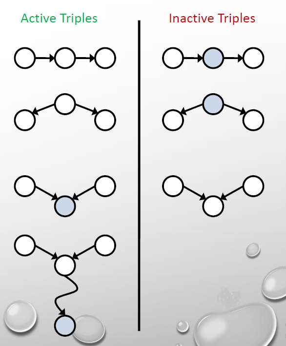
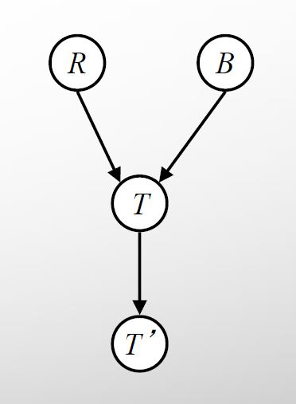
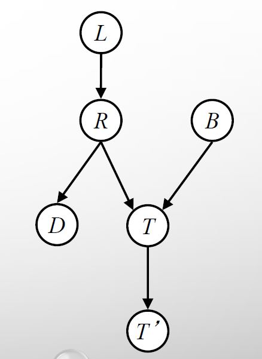
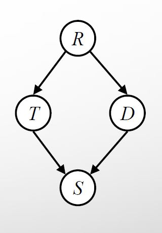
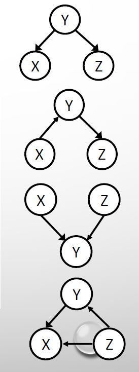

# **Bayesian Network: Representation**

## **Table of Content**
- [**Bayesian Network: Representation**](#bayesian-network-representation)
  - [**Table of Content**](#table-of-content)
  - [**D-separation**](#D-separation)
      - [**Outline**](#Outline)
      - [**Causal Chains**](#Causal-Chains)
        - [**Guaranteed X independent of Z ?**](#Guaranteed-X-independent-of-Z-?)
        - [**Guaranteed X independent of Z given Y?**](#Guaranteed-X-independent-of-Z-given-Y?)
      - [**Common Cause**](#Common-Cause)
        - [**Guaranteed X independent of Z ?** 2](#Guaranteed-X-independent-of-Z-?-2)
        - [**Guaranteed X and Z independent given Y?** 2](#Guaranteed-X-and-Z-independent-given-Y?-2)
    - [**Common Effect**](#Common-Effect)
        - [**Are X and Y independent?**](#Are-X-and-Y-independent?)
        - [**Are X and Y independent given Z?**](#Are-X-and-Y-independent-given-Z?)
    - [**General Case**](#General-Case)
        - [**Reachability**](#Reachability)
        - [**Active / Inactive Paths**](#Active-/-Inactive-Paths)
        - [**Examples**](#Examples)
  - [**Structure Implifications**](#Structure-Implifications)

## **D-separation**
In this section we're going to present a procedure named D-separation which determine different kinds of conditional independencies without algebric operations.
- ### **Outline**
    In the way of getting to D-separation algorithm, first we check that under what conditions we have conditional independency in simple triples; then we're going to generalize these simple cases to more complex ones with bigger graphs and present a general algorithm named D-separation.
- ### **Causal Chains**
    First configuration is "causal chain".
     <figure>
    
    <figcaption>&emsp;&emsp;&emsp;X: Low pressure &emsp;&emsp;&emsp;&emsp;&emsp;&emsp;&emsp;&emsp; Y: Rain &emsp;&emsp;&emsp;&emsp;&emsp;&emsp;&emsp;&emsp;&emsp;&emsp;&emsp;Z: Traffic  &emsp;&emsp;&emsp;P(x, y, z) = P(x) P(y|x) P(z|y)</figcaption>
    </figure>

    Example:  
        Low pressure causes rain ( P( +y | +x ) = 1 ), high pressure causes no rain ( P( -y | -x ) = 1 ), rain causes traffic ( P( +z | +y ) = 1 ), no rain causes no traffic ( P( -z | -y ) = 1 ) and we suppose that having low pressure or high pressure is a random process so we have P(+x) = P(-x) = 0.5 . 
        Pay attention that in this example we have just one random process and the other two variables' values are deterministic according to causal chain.  
    - #### **Guaranteed X independent of Z ?**
        The answer to this question is NO!  
        One example set of CPTs for which X is not independent of Z is sufficient to show this independence is not guaranteed. 
        So we need to compare P( Z | X ) vs P(Z) to figure out whether X and Z are independent or not. then we suppose that we have low pressure and traffic occured; means that we have +z for Z and +x for X so according to definition of this example we know P( +z | +x ) = 1 but for P(+z) we should check if we have low pressure or high pressure so P(+z) = 0.5 and this inequality proves that X and Z are not independent.
    - #### **Guaranteed X independent of Z given Y?**
         The answer to this question is YES!  
         So we need to compare P( z | x, y ) vs P( z | y ) to figure out with condition on Y are X and Z independent or not. Proof: 
         $$P( z | x, y ) = \frac{P( x, y, z )}{P( x, y )} = \frac{P(x)P( y | x )P( z | y )}{P(x)P( y | x )} = P( z | y )$$  
         the above proof shows that in triple causal chain, with condition on Y, the X and Z are independent.  
         So we can say that information we know about Y as a central node blocks the influence of X on Z and for intuition about this statement, we can say that the only way in graph for X to get to Z passes from Y so the dependence between X and Z is because of Y and X and Z are not directly related so with knowing Y, X wouldn't add any information for predicting Z to our current knowledge.
- ### **Common Cause**
     Second configuration is "common cause".
     <figure>
    
    <figcaption> P(x, y, z) = P(y) P(x|y) P(z|y) </figcaption>
    </figure>

    Example: 
        Deadline for a project is near and this causes forums get busy ( P(+x|+y) = 1, P(-x|-y) = 1 ) and lab gets full ( P(+z|+y) = 1, P(-z|-y) = 1 ) and we suppose that having near deadline or not is a stochastic process and divided equally so we have P(+y) = P(-y) = 0.5 . 
    - #### **Guaranteed X independent of Z ?** 2
        The answer to this question is NO!  
        One example set of CPTs for which X is not independent of Z is sufficient to show this independence is not guaranteed. So we need to compare P( Z | X ) vs P(Z) to figure out whether X and Z are independent or not. then we suppose that forums are busy and the lab is full; means that we have +z for Z and +x for X so according to definition of this example we know that we should have P( +z | +x ) = 1 but for P(+z) we should check if we have a near deadline or not so P(+z) = 0.5 and this inequality proves that X and Z are not independent in general case.
    - #### **Guaranteed X and Z independent given Y?** 2
        The answer to this question is YES! 
        So we need to compare P(z|x, y) vs P(z|y) to figure out with condition on Y are X and Z independent or not. Proof: 
        $$P( z | x, y ) = \frac{P( x, y, z )}{P( x, y )} = \frac{P(y)P( x | y )P( z | y )}{P(y)P( x | y )} = P( z | y )$$  
        the above proof shows that in triple common cause, with condition on Y, the X and Z are independent.  
        So in original case that we don't have any information about Y, knowledge about X lead us to conclusions about Y and then Z so we wouldn't have independency but in concitional form having information about blocks the path between X and Z so with knowing Y, X wouldn't add any information for predicting Z to our current knowledge.
- ### **Common Effect**
    Last configuration is "common effect" and sometimes called V-Structure.
     <figure>
    
    <figcaption> P(x, y, z) = P(x) P(y) P(z|x, y) </figcaption>
    </figure>

    In this structure, we have a phenomenon that has two different causes; For example both of raining and ballgame could cause traffic.

    - #### **Are X and Y independent?**
        The answer to this question is YES! 
        Although the ballgame and the rain cause traffic, but they are not correlated and with pure logic we understand it but still we need to prove this independency. Prove: 
        $$P(X, Y) = \sum_{z \in Z} P(X, Y, z) = \sum_{z \in Z} P(X)P(Y)P(z|X, Y) = P(X)P(Y) \sum_{z \in Z} P(z|X, Y) = P(X)P(Y)$$
        So according to above proof and definition of independency, X and Y in this structure are independent.
    - #### **Are X and Y independent given Z?**
        The answer to this question is NO!  
        Seeing traffic puts the rain and the ballgame in competition as explanation for occurance of traffic; it means that with seeing traffic, raining leads the possiblity of ballgame to lowest level and ballgame leads the possibility of raining to lowest level but this conclusion is just pure logic and for proving dependency, at least we need a counterexample.  
        So we suppose that P(+y) = P(+x) = 0.2 and P(-y) = P(-x) = 0.8 and for occurance of traffic we have: 
        
        - P(+z|+x, +y) = 0.95
        - P(+z|+x, -y) = 0.9
        - P(+z|-x, +y) = 0.9
        - P(+z|-x, -y) = 0.05  

        Now we can calculate P(+x|+z, +y) and P(+x|+z, -y) and for this purpose we should calculate P(+x, +z, +y), P(-x, +z, +y), P(+x, +z, -y) and P(-x, +z, -y). And with Bays' rule we have: 

        - P(+x, +z, +y) = 0.038
        - P(-x, +z, +y) = 0.144
        - P(+x, +z, -y) = 0.144
        - P(-x, +z, -y) = 0.032

        $$P(+x|+z, +y) = \frac{P(+x, +z, +y)}{P(+x, +z, +y) + P(-x, +z, +y)} = \frac{0.038}{0.182} = 0.209$$  

        $$P(+x|+z, -y) = \frac{P(+x, +z, -y)}{P(+x, +z, -y) + P(-x, +z, -y)} = \frac{0.144}{0.176} = 0.818$$  

        So since P(+x|+z, +y) and P(+x|+z, -y) aren't equal so given Z, X and Y aren't independent.  
        At last we can say that Observing an effect activates influence between possible causes and this situation is backwards from the last two cases we studied.
- ### **General Case** 
    Now with the last three cases, we want to check that in any desired graph, how much we can talk about available conditional independencies in that graph' structure.
    <figure>
    
    </figure>

    Usually in this case, they determine two variables and the question is that given some other variables of that BN, are the two determined variables independent or not?  
    The procedure we use is analyzing the graph with those triples that we learned so far and trying to conclude independency of determined variables. In the following, we're going to present steps of this procedure to you.

    - #### **Reachability** 
        First we shade the evidence nodes in the graph and then look for undirected paths between the two determined variables that we want to check independency among them, in the resulting graph. The first rule is if two nodes are connected by an undirected path blocked by a shaded node, they are conditionally independent. This rule almost works but not quite, actually at v-structure, this rule breaks.

        <figure>
        
        <figcaption> given R, L and B are conditionally independent  cause the path between them is blocked by R. </figcaption>
        </figure>

    - #### **Active / Inactive Paths**
        Question: Are X and Y conditionally independent given evidence variables {Z}? 
        Yes, if x and y d-separated by z; Now we should define d-separation. d-separation means if we consider all undirected paths from X to Y after shading evidence variables, and none of these paths weren't active paths, then we can say X and Y d-separated by Z. but what is an active path? A path is active if each triple of it is active; Active Triples:  

        - Causal chain A &rightarrow; B &rightarrow; C where B is unobserved (either direction)
        - Common cause A &leftarrow; B &rightarrow; C where B is unobserved
        - Common effect (aka v-structure)  
        A &rightarrow; B &leftarrow; C where B or one of its descendants is observed

        The active and inactive triples are shown in the picture below.

        <figure>
        
        </figure>
        
        Notice that a single inactive triple makes a path inactive and for claiming independency between X and Y, we need all paths to be inactive. If part of paths are inactive and part of them are active, neither we can say X and Y are independent nor we can say X and Y are dependant but probably we can make a example for these cases that shows X and Y are dependent.

    So in a nutshell, when we're given a query to determine conditionally independency of A and B given some evidence variables, we should check all paths between A and B: 

    - If one or more paths were active, then independence isn't guaranteed.
    - If all paths were inactive, then independence is guaranteed.

    - #### **Examples**
        1. we want to check out conditionally independency between R and B with different evidences in the Bayes Net below.

        <figure>
        
        </figure>

        - **without evidence:** there is only one path between R and B and that's an inactive path according to third type of inactive triples which was shown already. so R and B are independent.
        - **evidence = T:** according to third type of active triples which was shown already, the only path between R and B is active so R and B aren't guaranteed to be independent.
        - **evidence = T':** according to fourth type of active triples which was shown already, the only path between R and B is active so R and B aren't guaranteed to be independent.  

        2.     
        <figure>
        
        </figure>

        - **independency between L and T', evidence = T:** there is only one path between L and T' and that's an inactive path according to first type of inactive triples which was shown already. so L and T' are independent given T.
        - **independency between L and B, without evidence:** there is only one path between L and B and that's an inactive path according to third type of inactive triples which was shown already. so L and B are independent.
        - **independency between L and B, evidence = T:** according to third type of active triples which was shown already. the only path between L and B is active so L and B aren't guaranteed to be independent given T.
        - **independency between L and B, evidence = T':** according to fourth type of active triples which was shown already. the only path between L and B is active so L and B aren't guaranteed to be independent given T'.
        - **independency between L and B, evidence = T, R:** according to first type of inactive triples which was shown already. the only path between L and B is inactive so L and B are independent given T and R.  

        3. we want to check out conditionally independency between T and D with different evidences in the Bayes Net below.

        <figure>
        
        </figure>

        - **without evidence:** there are two paths between T and D and upper path is an active path according to second type of active triples which was shown already and lower path is an inactive path according to third type of inactive triples. so L and T aren't guarateed to be independent.
        - **evidence = R:** upper path is an inactive path according to second type of inactive triples which was shown already and lower path is an inactive path according to third type of inactive triples. so L and T are independent given R.
        - **evidence = R, S:** upper path is an inactive path according to second type of inactive triples which was shown already and lower path is an active path according to third type of active triples. so L and T are not guaranteed to be independent given R and S.

 ## **Structure Implifications**
The important question that arises here is that given a Bayes net structure, can run d-separation algorithm, build a complete list of conditional independences that are necessarily true of the form two variable that we should check out independency between them and a list of evidence variables that we should check conditional independency given them?  
The answer is NO! Actually d-separation algorithm helps us to conclide more conditional independences but for getting all of the conditional independences, we should get access to all the CPTs or suppose some special hypothesises about our bayes nets and the d-separation algorithm only helps us to get some of the conditional independences which are not obvious from bayes net definition and this procedure isn't covering.
Actually d-separation tries to find conditional independeces only from structure and our structure might be overspecified and then d-separation wouldn't work well and wouldn't find some of conditional independences. 
But there are some structures that d-separation algorithm can do a great job in them and will find all of the conditional independences of them. The structures below are good examples about this matter. 

<figure>

</figure>

- for the first one, we have that given Y, X and Z are conditionally independent. (Common Cause)
- for the second one, we have that given Y, X and Z are conditionally independent. (Causal Chains)
- for the third one, we have that X and Z are conditionally independent in general case. (Common Effect)
- for the last one, we have no conditionally independeces.